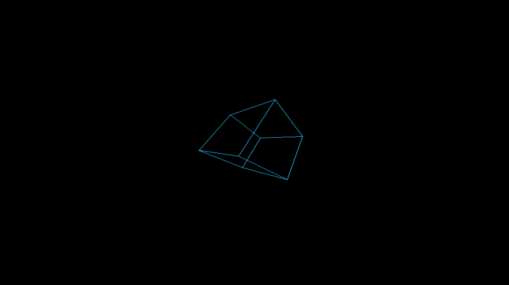

<p align="center">
  <b>OS built entirely from scratch.</b>
</p>

---

## 🔧 Building & Running

Make sure you got these packages set up: `nasm`, `qemu`, and `gcc`.  
Then just run:

```bash
make clean && make && make fs && make run
```

⚙️ Notes

- `make clean`:  wipes old object files
- `make`: compiles the kernel
- `make fs`:  builds the filesystem image
- `make run`: boots your OS in QEMU (or whatever emulator you’re using)